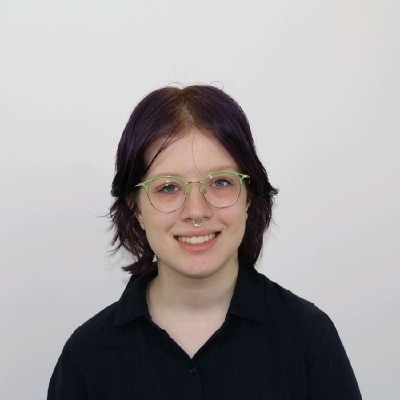
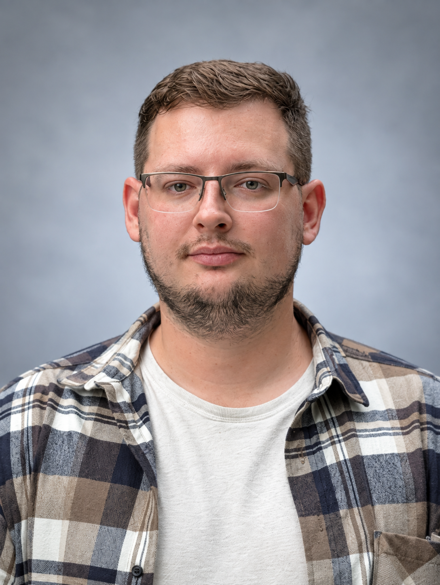
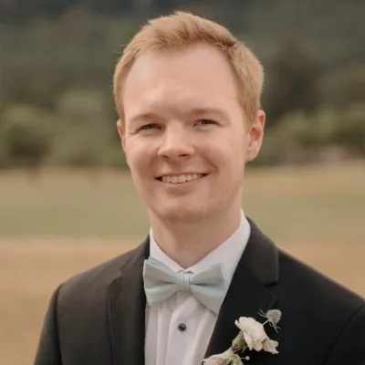
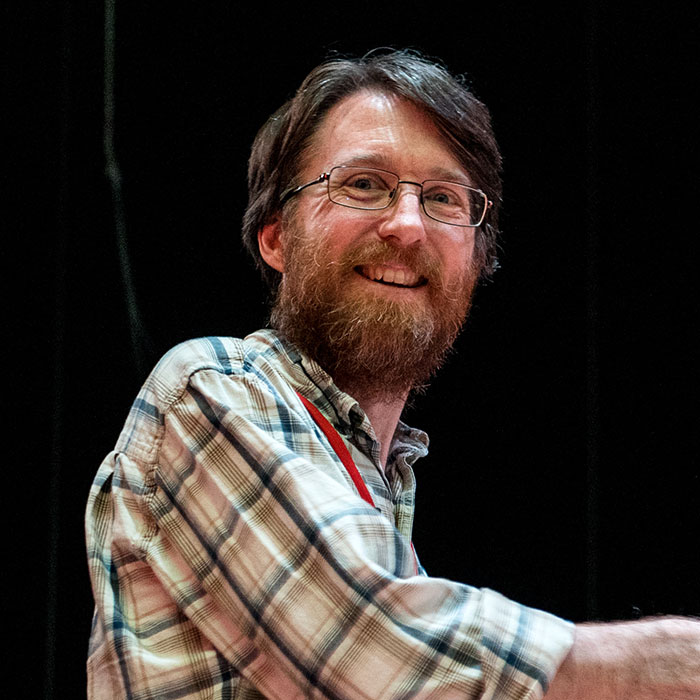

# Instructors

## Dr. Gustavo Sganzerla Martinez (he/him)

>
Postdoctoral Fellow 
Dalhousie University 
Halifax, Nova Scotia, Canada 
>
> --- gustavo.sganzerla@dal.ca

Gustavo works at the very intersection between computer science and biology. His main research interests involve the development of Artificial Intelligence frameworks for gathering insights in data from biological nature such as gene regulation in microorganisms (bacteria and archaea) and viruses. Having learned biology from biologists, Gustavo sees teaching computational methods as a way of giving back to the scientific community that shaped his interdisciplinary perspective. As as native software engineer, Gustavo is interested in making complex research methodologies easily accessible to those not familiar with the functioning of computers. 

## Dr. Zahra Sadeghi (she/her)

>
Research Scientist 
Dalhousie University 
Halifax, Nova Scotia, Canada 
>
> --- zahra.sadeghi@dal.ca

Dr. Zahra Sadeghi is a Machine Learning Research Scientist at Dalhousie University and has professional experience in AI and Machine Learning. With a PhD in AI and years of professional experience spanning both academia and industry, complemented by a strong track record of publications and research leadership, she has extensive expertise in advanced AI techniques and their application across a range of domains, including Computer VIsion, Natural Language Processing, Cognitive Science, and Climate modeling.

## Mackenzie Tapp (she/they)

>
Graduate Student 
Dalhousie University 
Halifax, Nova Scotia, Canada 
>
> --- mc295857@dal.ca

Mackenzie Tapp recently graduated from Dalhousie University with an Honours Co-Op Bachelor of Computer Science, with a minor in statistics and a certificate in intelligent systems. Throughout her undergraduate degree, she has participated in research involving computer vision, natural language processing, and speech diarization. She has recently begun a Masters of Applied Science in Biomedical Engineering at Dalhousie University, where she will be investigating applications of machine learning algorithms in neuroscience. 

## Dmytro Tymoshenko (he/him)

>
PhD Candidate 
Dalhousie University 
Halifax, Nova Scotia, Canada 
>
> --- dy970485@dal.ca

Dmytro works at the intersection of genomics and machine learning, using deep learning models to study complex symbiotic relationships between microbial and eukaryotic organisms, and between eukaryotes themselves. His bioinformatics background spans undergraduate and graduate training, including research applying computer vision and feature selection to biological data, and industry experience developing data-efficient neural network models to optimize treatment response in personalized cancer therapy. He is drawn to questions difficult to formalize computationally and is passionate about pushing the frontier of what machine learning can answer in biology.

# Facilitator

## Ben Fisher (he/him)

>
Regional Coordinator, CBH Atlantic 
Canadian Bioinformatics Hub, Dalhousie University 
Halifax, NS, Canada
>
> --- atlantic@bioinformatics.ca

Ben has a Master of Science degree in Microbiology and Immunology, completing his bioinformatics training under Dr. Morgan Langille at Dalhousie University. Throughout his training, he has instructed others in genetics, molecular biology, and microbiome data science. Ben is passionate about continued education of trainees and professionals, and firmly believes that enhancing bioinformatics and computational biology competencies will support the success of Canada’s current and future scientists.

# Systems Administrator

## Dr. Ross Dickson (he/him)

>
Senior Digital Research Consultant 
ACENET 
Halifax, NS, Canada
>
> --- ross.dickson@ace-net.ca

Based at Dalhousie University, Ross joined ACENET in 2007 as a Research Consultant. With both academic research and industry software development experience, his responsibilities span education, documentation, and client support. As a senior consultant, Ross has worked with clients in almost every discipline – chemistry, physics, biology, oceanography, neuroscience, engineering, philosophy, and management studies, just to name a few.